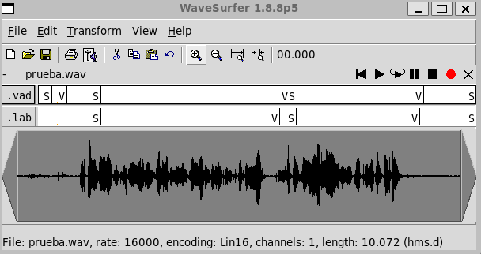

PAV - P2: detección de actividad vocal (VAD)
============================================

Esta práctica se distribuye a través del repositorio GitHub [Práctica 2](https://github.com/albino-pav/P2),
y una parte de su gestión se realizará mediante esta web de trabajo colaborativo.  Al contrario que Git,
GitHub se gestiona completamente desde un entorno gráfico bastante intuitivo. Además, está razonablemente
documentado, tanto internamente, mediante sus [Guías de GitHub](https://guides.github.com/), como
externamente, mediante infinidad de tutoriales, guías y vídeos disponibles gratuitamente en internet.


Inicialización del repositorio de la práctica.
----------------------------------------------

Para cargar los ficheros en su ordenador personal debe seguir los pasos siguientes:

*	Abra una cuenta GitHub para gestionar esta y el resto de prácticas del curso.
*	Cree un repositorio GitHub con el contenido inicial de la práctica (sólo debe hacerlo uno de los
	integrantes del grupo de laboratorio, cuya página GitHub actuará de repositorio central del grupo):
	-	Acceda la página de la [Práctica 2](https://github.com/albino-pav/P2).
	-	En la parte superior derecha encontrará el botón **`Fork`**. Apriételo y, después de unos segundos,
		se creará en su cuenta GitHub un proyecto con el mismo nombre (**P2**). Si ya tuviera uno con ese 
		nombre, se utilizará el nombre **P2-1**, y así sucesivamente.
*	Habilite al resto de miembros del grupo como *colaboradores* del proyecto; de este modo, podrán
	subir sus modificaciones al repositorio central:
	-	En la página principal del repositorio, en la pestaña **:gear:`Settings`**, escoja la opción 
		**Collaborators** y añada a su compañero de prácticas.
	-	Éste recibirá un email solicitándole confirmación. Una vez confirmado, tanto él como el
		propietario podrán gestionar el repositorio, por ejemplo: crear ramas en él o subir las
		modificaciones de su directorio local de trabajo al repositorio GitHub.
*	En la página principal del repositorio, localice el botón **Branch: master** y úselo para crear
	una rama nueva con los primeros apellidos de los integrantes del equipo de prácticas separados por
	guion (**fulano-mengano**).
*	Todos los miembros del grupo deben realizar su copia local en su ordenador personal.
	-	Copie la dirección de su copia del repositorio apretando en el botón **Clone or download**.
		Asegúrese de usar *Clone with HTTPS*.
	-	Abra una sesión de Bash en su ordenador personal y vaya al directorio **PAV**. Desde ahí, ejecute:

		```.sh
		git clone dirección-del-fork-de-la-práctica
		```

	-	Vaya al directorio de la práctica `cd P2`.

	-	Cambie a la rama **fulano-mengano** con la orden:

		```.sh
		git checkout fulano-mengano
		```

*	A partir de este momento, todos los miembros del grupo de prácticas pueden trabajar en su directorio
	local del modo habitual, usando el repositorio remoto en GitHub como repositorio central para el trabajo colaborativo
	de los distintos miembros del grupo de prácticas o como copia de seguridad.
	-	Puede *confirmar* versiones del proyecto en su directorio local con las órdenes siguientes:

		```.sh
		git add .
		git commit -m "Mensaje del commit"
		```

	-	Las versiones confirmadas, y sólo ellas, se almacenan en el repositorio y pueden ser accedidas en cualquier momento.

*	Para interactuar con el contenido remoto en GitHub es necesario que los cambios en el directorio local estén confirmados.

	-	Puede comprobar si el directorio está *limpio* (es decir, si la versión actual está confirmada) usando el comando
		`git status`.

	-	La versión actual del directorio local se sube al repositorio remoto con la orden:

		```.sh
		git push
		```

		*	Si el repositorio remoto contiene cambios no presentes en el directorio local, `git` puede negarse
			a subir el nuevo contenido.

			-	En ese caso, lo primero que deberemos hacer es incorporar los cambios presentes en el repositorio
				GitHub con la orden `git pull`.

			-	Es posible que, al hacer el `git pull` aparezcan *conflictos*; es decir, ficheros que se han modificado
				tanto en el directorio local como en el repositorio GitHub y que `git` no sabe cómo combinar.

			-	Los conflictos aparecen marcados con cadenas del estilo `>>>>`, `<<<<` y `====`. Los ficheros correspondientes
				deben ser editados para decidir qué versión preferimos conservar. Un editor avanzado, del estilo de Microsoft
				Visual Studio Code, puede resultar muy útil para localizar los conflictos y resolverlos.

			-	Tras resolver los conflictos, se ha de confirmar los cambios con `git commit` y ya estaremos en condiciones
				de subir la nueva versión a GitHub con el comando `git push`.


	-	Para bajar al directorio local el contenido del repositorio GitHub hay que ejecutar la orden:

		```.sh
		git pull
		```
	
		*	Si el repositorio local contiene cambios no presentes en el directorio remoto, `git` puede negarse a bajar
			el contenido de este último.

			-	La resolución de los posibles conflictos se realiza como se explica más arriba para
				la subida del contenido local con el comando `git push`.


*	Al final de la práctica, la rama **fulano-mengano** del repositorio GitHub servirá para remitir la
	práctica para su evaluación utilizando el mecanismo *pull request*.
	-	Vaya a la página principal de la copia del repositorio y asegúrese de estar en la rama
		**fulano-mengano**.
	-	Pulse en el botón **New pull request**, y siga las instrucciones de GitHub.


Entrega de la práctica.
-----------------------

Responda, en este mismo documento (README.md), los ejercicios indicados a continuación. Este documento es
un fichero de texto escrito con un formato denominado _**markdown**_. La principal característica de este
formato es que, manteniendo la legibilidad cuando se visualiza con herramientas en modo texto (`more`,
`less`, editores varios, ...), permite amplias posibilidades de visualización con formato en una amplia
gama de aplicaciones; muy notablemente, **GitHub**, **Doxygen** y **Facebook** (ciertamente, :eyes:).

En GitHub. cuando existe un fichero denominado README.md en el directorio raíz de un repositorio, se
interpreta y muestra al entrar en el repositorio.

Debe redactar las respuestas a los ejercicios usando Markdown. Puede encontrar información acerca de su
sintáxis en la página web [Sintaxis de Markdown](https://daringfireball.net/projects/markdown/syntax).
También puede consultar el documento adjunto [MARKDOWN.md](MARKDOWN.md), en el que se enumeran los
elementos más relevantes para completar la redacción de esta práctica.

Recuerde realizar el *pull request* una vez completada la práctica.

Ejercicios
----------

### Etiquetado manual de los segmentos de voz y silencio

- Etiquete manualmente los segmentos de voz y silencio del fichero grabado al efecto. Inserte, a 
  continuación, una captura de `wavesurfer` en la que se vea con claridad la señal temporal, el contorno de
  potencia y la tasa de cruces por cero, junto con el etiquetado manual de los segmentos.

	

	> Este es el contenido del fichero de transcripción *.lab*. Con este formato analizaremos después la calidad de nuestro detector. 


- A la vista de la gráfica, indique qué valores considera adecuados para las magnitudes siguientes:

	* Incremento del nivel potencia en dB, respecto al nivel correspondiente al silencio inicial, para
	  estar seguros de que un segmento de señal se corresponde con voz.

	  	> Pondremos un nivel de 15 dB sobre el silencio para suponer que estamos analizando señal que incluye voz.

	* Duración mínima razonable de los segmentos de voz y silencio.

		> El silencio más corto que hemos etiquetado en nuestro audio dura aproximadamente 200 ms, dejaremos un pequeño margen y estableceremos un tiempo mínimo de 150 ms. El segmento de voz de menor duración que hemos etiquetado dura 960 ms, dejando margen, podemos exigir 600 ms de voz para etiquetar el segmento como tal.


	* ¿Es capaz de sacar alguna conclusión a partir de la evolución de la tasa de cruces por cero?
		
		> Notamos que en las transiciones de segmentos de silencio a voz, es decir, al inicio de palabras, suele haber picos en la tasa de cruces por cero. Además, este parametro suele ser mas ruidoso y alto en los segmentos de silencio.


### Desarrollo del detector de actividad vocal

- Complete el código de los ficheros de la práctica para implementar un detector de actividad vocal en
  tiempo real tan exacto como sea posible. Tome como objetivo la maximización de la puntuación-F `TOTAL`.

	> Jugando con los parametros del detector, encontramos un buen resultado sobre la base de datos con los siguientes valores:

		```vad_data->alpha1 = 2.06;
		vad_data->alpha2 = 5.91;
		vad_data->min_silence = 0.069;
		vad_data->min_voice = 0.01;
		```
	> Como vemos a continuación, obtenemos un F-TOTAL de 90.787%
		```
		**************** media/PAV_P2.lab ****************
		Warning: adding extra silence [7.8447152, 7.97606] at the end of ref: media/PAV_P2.lab
		Recall V:  5.16/5.25   98.38%   Precision V:  5.16/6.16   83.86%   F-score V (2)  : 95.09%
		Recall S:  1.74/2.73   63.58%   Precision S:  1.74/1.82   95.34%   F-score S (1/2): 86.68%
		===> media/PAV_P2.lab: 90.787% 
		```
		
- Inserte una gráfica en la que se vea con claridad la señal temporal, el etiquetado manual y la detección
  automática conseguida para el fichero grabado al efecto. 

	

- Explique, si existen. las discrepancias entre el etiquetado manual y la detección automática.

- Evalúe los resultados sobre la base de datos `db.v4` con el script `vad_evaluation.pl` e inserte a 
  continuación las tasas de sensibilidad (*recall*) y precisión para el conjunto de la base de datos (sólo
  el resumen).

  ```
  ****************Summary****************
  Recall V:471.65/495.55 95.18%   Precision V:471.65/535.77 88.03%   F-score V (2)  : 93.66%
  Recall S:257.05/321.17 80.03%   Precision S:257.05/280.95 91.49%   F-score S (1/2): 88.95%
  ===> TOTAL: 91.271%
  ```


### Trabajos de ampliación

#### Cancelación del ruido en los segmentos de silencio

- Si ha desarrollado el algoritmo para la cancelación de los segmentos de silencio, inserte una gráfica en
  la que se vea con claridad la señal antes y después de la cancelación (puede que `wavesurfer` no sea la
  mejor opción para esto, ya que no es capaz de visualizar varias señales al mismo tiempo).

  

#### Gestión de las opciones del programa usando `docopt_c`

- Si ha usado `docopt_c` para realizar la gestión de las opciones y argumentos del programa `vad`, inserte
  una captura de pantalla en la que se vea el mensaje de ayuda del programa.
```
  $ bin/vad -h
  VAD - Voice Activity Detector 

  Usage:
	vad [options] -i <input-wav> -o <output-vad> [-w <output-wav>]
	vad (-h |--help)
	vad --version

  Options:
	-i FILE, --input-wav=FILE   WAVE file for voice activity detection
	-o FILE, --output-vad=FILE  Label file with the result of VAD
	-w FILE, --output-wav=FILE  WAVE file with silences cleared
	-1 FLOAT, --alpha1=FLOAT    alpha1 [default: 2.06]
	-2 FLOAT, --alpha2=FLOAT    alpha2 [default: 5.91]
	-S FLOAT, --min_silence=FLOAT    min_silence [default: 0.069]
	-V FLOAT, --min_voice=FLOAT    min_voice [default: 0.01]
	-v, --verbose  Show debug information
	-h, --help     Show this screen
	--version      Show the version of the project
```

### Contribuciones adicionales y/o comentarios acerca de la práctica

- Indique a continuación si ha realizado algún tipo de aportación suplementaria (algoritmos de detección o 
  parámetros alternativos, etc.).
  	> Para encontrar los mejores parametros para evaluar la base de datos, hemos relizado un pequeño script (*scripts/parameter_finder.sh*) que, dados unos umbrales (maximo y mínimo) y un valor de paso para cada uno de los 3 parametros que soporta, evalua todas las combinaciones posibles y va presentando por pantalla la mejor de todas.
```
DIR_P2=$HOME/PAV/P2
DB=$DIR_P2/db.v4
CMD=$DIR_P2/bin/vad 
BESTSCORE=0
for PARAM1 in $(seq 0 .2 6);
do
    for PARAM2 in $(seq 0 .2 6);
    do
	echo -e -n "\rVAD with alpha1=$PARAM1 and alpha2=$PARAM2"
	for filewav in $DB/*/*wav; 
	do
	    filevad=${filewav/.wav/.vad}
	    $CMD -i $filewav -o $filevad -1 $PARAM1 -2 $PARAM2 || exit 1
	done
	A=$(scripts/vad_evaluation_noverb.pl $DB/*/*lab)
	if ! echo "$A $BESTSCORE -p" | dc | grep > /dev/null ^-; then
	    BESTSCORE=$A
	    BESTP1=$PARAM1
	    BESTP2=$PARAM2
	    clear
	    echo "New Best score $BESTSCORE with parameters alpha1=$BESTP1 and alpha2=$BESTP2"
	fi
	echo "$PARAM1 $PARAM2 $A" >> out.txt
	#echo $($A-100)
    done
done
exit 0
```

- Si lo desea, puede realizar también algún comentario acerca de la realización de la práctica que
  considere de interés de cara a su evaluación.


### Antes de entregar la práctica

Recuerde comprobar que el repositorio cuenta con los códigos correctos y en condiciones de ser 
correctamente compilados con la orden `meson bin; ninja -C bin`. El programa generado (`bin/vad`) será
el usado, sin más opciones, para realizar la evaluación *ciega* del sistema.
